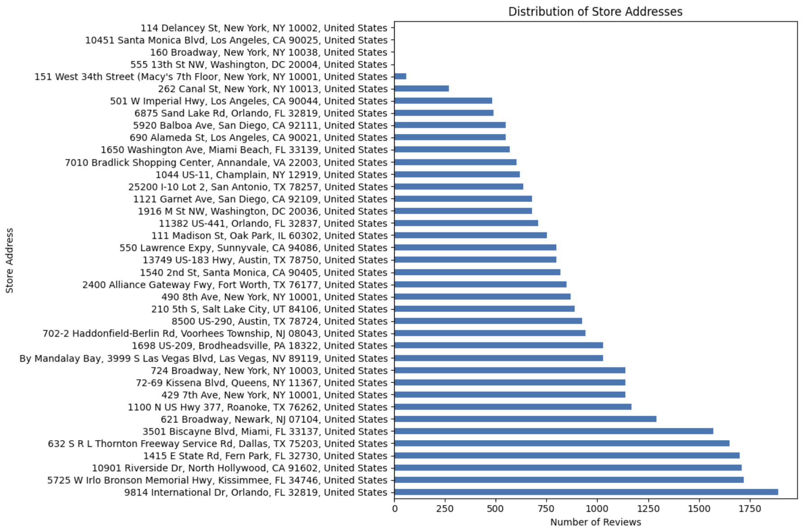
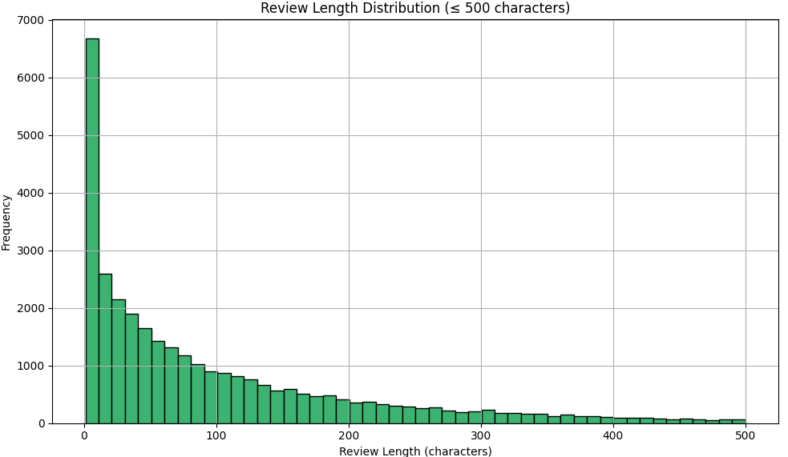
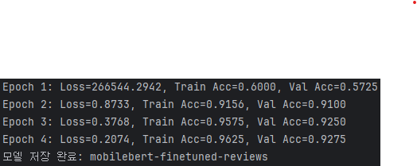

## MobileBERT를 활용한 멕도날드 매장 리뷰 감성분석 프로젝트
---
## 1. 개요
---

패스트푸드 프랜차이즈는 소비자와의 접점이 많은 업종으로, 고객 리뷰는 매장 서비스 품질과 브랜드 이미지에 직접적인 영향을 미친다. 
그중에서도 멕도날드는 전 세계적으로 가장 많은 매장을 운영하는 브랜드 중 하나이며, 국내에서도 주요 상권마다 매장을 보유하고 있다.
이러한 리뷰 데이터를 분석함으로써 고객 불만 요인을 파악하고, 서비스 품질 개선의 방향성을 도출할 수 있다.

본 프로젝트에서는 멕도날드 매장에 대한 온라인 리뷰를 분석하여 감성(긍정/부정)을 분류하고, 부정 리뷰가 집중된 항목을 정리해보려 한다.
이를 통해 브랜드 이미지 관리 및 운영 개선에 도움이 되는 인사이트를 도출하고자 한다.

---
## 2. 데이터

[[데이터 원본]](https://www.kaggle.com/datasets/nelgiriyewithana/mcdonalds-store-reviews)

### 2-1 데이터 구성

| reviewer_id | store_name | category | store_address | latitude | longitude | rating_count | review_time | review | rating |
|-------------|-------|--------|------------|---------|---------|------------|-------------|--------|--------|
| 고유 식별자      | 매장명   | 카테고리   | 매장 주소      | 위도      | 경도      | 평점개수       | 리뷰날짜        | 리뷰     | 평점     |

데이터 수는 33,096건이 있고, 평점은 1점부터5점까지 구성되어있다.

### 2-2 데이터 부가정보

총 39개의 매장에서 조사한 리뷰들이다.

리뷰 문장 길이 500자 이하 그래프이다.
10자 리뷰가 가장 많이 나타난다.

---
## 3. 데이터 전처리

MobileBERT를 활용한 리뷰 기반 감성 분류 모델을 학습시키기 위해 모델 입력에 불필요한 정보를 제거하고 핵심 텍스트(review)와 레이블(rating)만 남겨 데이터 전처리를 수행하였다.
이를 통해 학습 효율성과 성능 향상을 도모하였다.

'rating'에서 1,2점은 0(부정) 4,5점은 1(긍정)으로 라벨링 하였고, 3점은 제거하였다.

| |review|label|
|-|------|--------|
|1|Why does it look like someone spit on my food?...|0|
|2|It'd McDonalds. It is what it is as far as the food and atmosphere go...|1|
|..|...|..|
|28511|It's good, but lately it has become very expensive...|1|
|28512|they took good care of me|1|

전테 데이터 33,096건에서 렌덤으로 긍정 1000건, 부정 1000건만 가져와서 모델을 학습시켰다.

| |review|label|
|-|------|--------|
|1|Shitty service shitty employees|0|
|2|not bad ehh....|1|
|..|...|..|
|1999|rude|0|
|2000|The People Who Work There Were Very Rude&Short In Response...|0|

---
## 4. 결과

### 4-1 MobileBERT 학습 결과

렌덤으로 긍정 1000건, 부정 1000건으로 학습시킨 결과이다.
모델 학습은 총 4 에폭(epoch)에 걸쳐 수행되었다.

초기 에폭에서는 손실이 매우 크고 정확도가 낮았으나, 이후 빠르게 성능이 향상되었다. 에폭 2부터는 훈련 및 검증 정확도가 안정적으로 상승하며,
최종적으로 훈련 정확도 96.25%, 검증 정확도 92.75%를 기록하였다. 과적합 문제는 거의 없으며, 손실 감소 추세를 통해 모델이 안정적으로 수렴했음을 확인할 수 있다. 
최종 모델은 mobilebert-finetuned-reviews로 저장되었으며, 실제 감성 분류에 활용 가능하다.

### 4-2 모델 적용 결과

*전체 데이터에 대한 멕도날드리뷰 긍부정 정확도 :  0.9284837431166918*

파인튜닝된 MobileBERT 모델은 맥도날드 리뷰에 대해 약 92.85%의 정확도를 기록했다. 이는 검증 정확도(92.75%)와 유사하며, 
모델이 실제 데이터에서도 우수한 일반화 성능을 보였음을 의미한다. 따라서 본 모델은 감성 분류 실무 적용에 적합한 성능을 갖추었다.

---
## 5. 결론 및 느낀점

본 프로젝트에서는 MobileBERT를 활용해 맥도날드 리뷰의 감성 분류 모델을 구축하였으며, 테스트 정확도는 **92.85%**로 높은 성능을 보였다. 학습 과정과 결과 모두 안정적이었고, 실제 서비스에 적용 가능한 수준임을 확인할 수 있었다.
다만, review와 rating 외에 다른 컬럼(예: 제품, 지역, 날짜 등)을 모델에 활용하지 못한 점은 아쉬움으로 남는다. 향후에는 이들 메타데이터를 활용하거나 다중 분류·요약 모델 등으로 확장해볼 수 있을 것이다. 이번 프로젝트를 통해 모델 학습 전 과정을 실습하며 실질적인 분석 역량을 키울 수 있었다.
